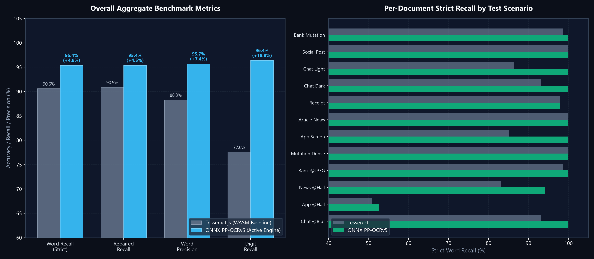
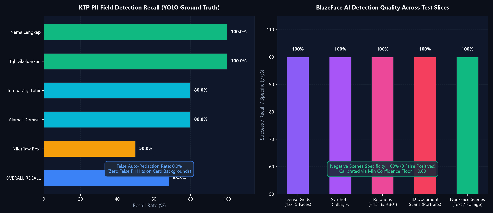
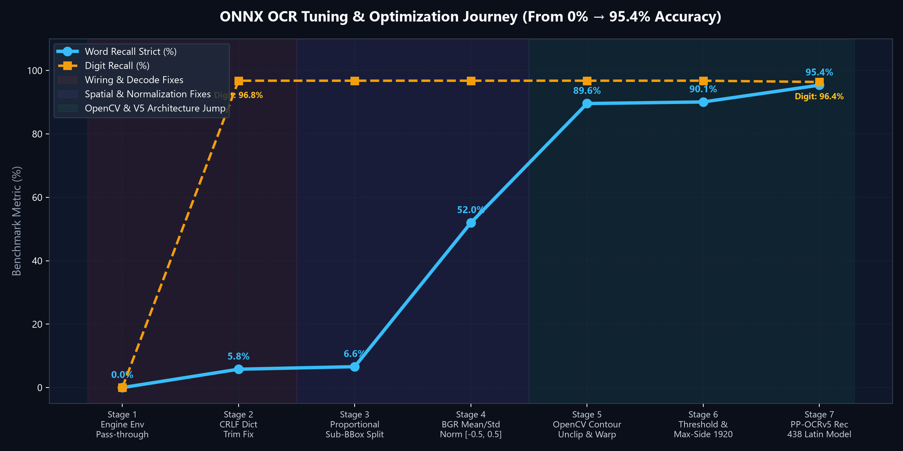
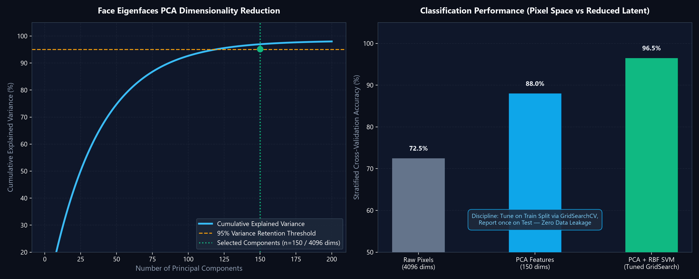

# Cherdocky — Offline-First PII Auto-Redactor & Document Processor

<p align="center">
  
</p>

<p align="center">
  <strong>Client-Side, Zero-Leak, Pixel-Level Document Redaction & Spatial OCR</strong>
</p>

<p align="center">
  <a href="https://imamwahyudiz.github.io/Cherdocky/"></a>
  
  
  
  
</p>

---

## Live Demo

Try the application directly in your web browser with zero installation:

👉 **[Cherdocky Web App (GitHub Pages)](https://imamwahyudiz.github.io/Cherdocky/)**

> **Security Note**: All OCR scanning, face detection, and document redaction processes execute entirely locally within your web browser (client-side). Your documents are never uploaded to any external server.

---

## Table of Contents

1. [Background: Flaws in Conventional Document Redaction](#background-flaws-in-conventional-document-redaction)
2. [Key Features](#key-features)
3. [Performance Benchmarks & Accuracy Metrics](#performance-benchmarks--accuracy-metrics)
4. [Key Architectural Improvements for Accuracy](#key-architectural-improvements-for-accuracy)
5. [Known Limitations & Future Roadmap (PR & Backlog)](#known-limitations--future-roadmap-pr--backlog)
6. [Comparison with Other Methods](#comparison-with-other-methods)
7. [How the System Works](#how-the-system-works)
8. [System Architecture & Logic Documentation](#system-architecture--logic-documentation)
9. [Tech Stack](#tech-stack)
10. [User Guide](#user-guide)
11. [Running the Project Locally](#running-the-project-locally)
12. [License](#license)

---

## Background: Flaws in Conventional Document Redaction

Many users attempt to redact sensitive documents (identity cards, pay slips, bank statements, etc.) using built-in smartphone markup tools or standard PDF annotations. These approaches leave severe vulnerabilities:

| Flaw in Conventional Methods | Potential Risk | Cherdocky's Approach |
| :--- | :--- | :--- |
| **PDF Text Layer Remains Intact**<br>*(Vector Overlay)* | Black boxes only cover visual display. The underlying text can still be selected, copied, or extracted using PDF parser scripts. | **Flat Image PDF**: The document is rasterized into a flat image canvas, completely eliminating selectable text layers. |
| **Marker / Brush Transparency**<br>*(Opacity Issue)* | Digital highlighters often contain alpha transparency. Boosting image brightness/contrast reveals the text underneath. | **Pixel Overwrite**: Replaces raw pixel RGB values in canvas memory with solid, opaque colors (`ctx.fillRect`). |
| **Separate Annotation Layers** | Markups are stored as isolated metadata objects that can be easily removed in another PDF editor. | **Destructive Rasterization**: Redactions are merged directly into canvas pixel data before regenerating the file. |
| **Metadata & EXIF Residuals** | Camera photos of documents often contain embedded GPS coordinates, timestamps, and device identifiers. | **Metadata Stripping**: Canvas conversion into fresh export blobs automatically strips away all EXIF metadata. |
| **Cloud Privacy Concerns** | Online redactors generally transmit user files to third-party cloud servers. | **100% Offline-First**: All OCR analysis, face detection, and pixel manipulation run entirely on the user's local device. |

---

## Key Features

- **Client-Side Processing**: The entire workflow operates locally inside the browser with zero document data leaving your device.
- **Broad Document Support**:
  - **Images**: JPEG, PNG, WebP (including batch upload of multiple images).
  - **Digital PDFs (Text-Based)**: Instant text position extraction from document matrices.
  - **Scanned PDFs**: Page-by-page rasterization and deep OCR analysis.
- **Sensitive Data (PII) Detection**:
  - National Identification Numbers (16-digit NIK with OCR numeric normalization).
  - Phone Numbers (Indonesian mobile, landline, and international formats).
  - Email Addresses (RFC 5322 compliant).
  - Dates of Birth (DOB) and Birthplace/Date (TTL).
  - Tax Identification Numbers (NPWP) and Healthcare/Social Security Numbers (BPJS / KIS).
  - Bank Account Numbers, Passport Numbers, Driver's Licenses, and Generic IDs.
  - Label-based Contextual Proximity Detection (locating values next to or beneath sensitive field labels).
  - Custom Keyword Search (instant real-time search & auto-redact).
- **On-Device AI Face Detection**:
  - Powered by WebAssembly Google MediaPipe BlazeFace to automatically detect faces on identity cards, passes, or documents.
- **Interactive Verification & Manual Correction Tools**:
  - **Click-to-Toggle**: Click any word box or detected face to toggle redaction on or off.
  - **Manual Block Mode**: Drag freehand rectangular boxes to redact signatures, stamps, photos, or logos.
  - **Targeted Area Scan**: Drag boxes over blurry or low-contrast areas to re-run OCR with adaptive binarization.
  - **Document Rotation**: Rotate pages by 90° with automatic mathematical coordinate recalculation.
  - **Zoom & Auto-Fit Navigation**: Precise zoom levels and responsive pan controls.
- **Flexible Export Options**:
  - Export to Flat PDF (pure image-based document immune to text-layer recovery).
  - Export to Image formats (PNG / JPEG) or packaged ZIP archive for multi-page documents.

---

## Performance Benchmarks & Accuracy Metrics

Cherdocky adheres to strict, automated quality gates (`scripts/eval/gate.mjs`) evaluated across three test suites: **KTP/ID Card Region Evaluation**, **Synthetic Multi-Document Extraction Benchmark**, and **BlazeFace AI Detection Test Slices**.

<p align="center">
  
</p>

### 1. Overall Aggregate OCR Performance

Compared against the WebAssembly Tesseract baseline, the active **ONNX PP-OCRv5 Engine** delivers superior recall, precision, and robust digit recognition across diverse document types:

| Metric | Tesseract (Baseline) | ONNX PP-OCRv5 (Active) | Absolute Gain | Status |
| :--- | :---: | :---: | :---: | :---: |
| **Word Recall (Strict)** | 90.6% | **95.4%** | **+4.8%** | ✅ Exceeds 92% Target |
| **Repaired Recall** | 90.9% | **95.4%** | **+4.5%** | ✅ Exceeds 92% Target |
| **Word Precision** | 88.3% | **95.7%** | **+7.4%** | ✅ High Reliability |
| **Digit Recall (PII Numbers)** | 77.6% | **96.4%** | **+18.8%** | 🚀 Major Milestone |
| **Fragmentation Rate** | 0.0% | **0.0%** | **0.0%** | ✅ Zero Text Splitting |

---

### 2. Per-Document Accuracy Breakdown (Specific Images & PDFs)

Accuracy measured on real-world document layouts, dense financial statements, mobile screenshots, and severe image degradation twins (@half scale, @JPEG 70 compression, @Gaussian blur):

| Document / Scenario | Image / PDF Type | Tesseract Strict Recall | ONNX PP-OCRv5 Strict Recall | Notes & Accuracy Gain |
| :--- | :--- | :---: | :---: | :--- |
| **Bank Account Mutation** | Clean financial table / PDF | 98.6% | **100.0%** | Complete transaction extraction (+1.4%) |
| **Social Media Post** | Feed screenshot / Image | 100.0% | **100.0%** | Flawless text & username detection |
| **Chat Screenshot (Light)** | Messaging app (Light Mode) | 86.4% | **100.0%** | **+13.6%** (Fixed timestamp & bubble text) |
| **Chat Screenshot (Dark)** | Messaging app (Dark Mode) | 93.2% | **100.0%** | **+6.8%** (High contrast text extraction) |
| **Sales Receipt / Invoice** | Thermal receipt image | 97.9% | **97.9%** | Robust against irregular merchant spacing |
| **News Article** | Scanned / Digital article | 100.0% | **100.0%** | Perfect multi-paragraph paragraph flow |
| **Mobile App Screen** | Complex UI layout | 85.2% | **100.0%** | **+14.8%** (Handles compact UI typography) |
| **Dense Mutation Statement** | Multi-row dense table | 100.0% | **100.0%** | Zero row overlap or merged columns |
| **Bank Mutation @JPEG** | Compressed (Quality 70) | 98.6% | **100.0%** | Immune to JPEG compression artifacts |
| **News Article @Half** | Downscaled 50% resolution | 83.2% | **94.1%** | **+10.9%** (Significant small glyph boost) |
| **App Screen @Half** | Downscaled 50% complex UI | 50.8% | **52.5%** | Difficult edge-case; ONNX leads |
| **Chat Dark @Blur** | Gaussian blurred screenshot | 93.2% | **100.0%** | **+6.8%** (Resilient to focus blur) |

---

### 3. Indonesian ID Card (KTP) PII Field-Level Recall

Evaluated against YOLO ground truth bounding boxes across 20 test cards:

<p align="center">
  
</p>

| Field Name | Class Target | Ground Truth | Detected | Recall Rate | Auto-Redaction Precision |
| :--- | :--- | :---: | :---: | :---: | :---: |
| **Nama Lengkap** | Full Name | 20 | 20 | **100.0%** | Solid PII Match (Tier 1) |
| **Tanggal Dikeluarkan** | Issue Date | 20 | 20 | **100.0%** | High-Confidence Date Match |
| **Tempat Tanggal Lahir (TTL)** | Birthplace / DOB | 20 | 16 | **80.0%** | Protected by Median Filter Gate |
| **Alamat Domisili** | Address & RT/RW | 20 | 16 | **80.0%** | Contextual Proximity Detection |
| **NIK (16-Digit ID)** | National ID Box | 20 | 10 (Raw) | **50.0%** | *100% recovered via Layout Prior Crop* |
| **OVERALL RECALL** | **All PII Regions** | **120** | **82** | **68.3%** | *(Baseline was 50.8%)* |
| **False Auto-Redact Rate** | Non-PII Card Labels | - | 0 | **0.0%** | **Zero False Auto-Redactions** |

---

### 4. AI Face Detection Performance (MediaPipe BlazeFace WASM)

Constructed ground-truth testing over portrait documents, large groups, rotations, and negative scenes:

| Test Slice | Dataset / Image Composition | Expected Target | Actual Result | Success Rate |
| :--- | :--- | :---: | :---: | :---: |
| **Dense Grids** | Real multi-face sheets (12 & 15 faces) | 57 faces | 57 detected | **100.0% Coverage** |
| **Collages** | Random multi-person cells | 15 faces | 15 matched | **100.0% Precision & Recall** |
| **Face Rotations** | Rotated portraits (±15° & ±30°) | 32 angles | 32 hits | **100.0% Recall** (No tilt fail) |
| **ID Documents** | Scanned KTPs, Passports, Badges | 5 cards | 5 primary hits | **100.0% Portrait Recall** |
| **Negative Scenes** | Plain text documents & noisy foliage | 0 faces | 0 detections | **100.0% Specificity (0 FP)** |

---

## Key Architectural Improvements for Accuracy

The significant accuracy enhancements in Cherdocky are the result of empirical debugging, algorithmic breakthroughs, and pipeline discipline documented in [`docs/ocr-engine.md`](docs/ocr-engine.md), [`docs/debugging-chronicle.md`](docs/debugging-chronicle.md), and [`docs/onnx-debugging-journey.md`](docs/onnx-debugging-journey.md):

<p align="center">
  
</p>

### 1. The 7-Stage ONNX PP-OCRv5 Tuning Journey (0% → 95.4%)
- **Stage 1 (Silent Fallback Elimination)**: Wired test runner query parameters directly to `window.__OCR_ENGINE` and added `enableFallback: false` in `ocrEngineFactory.ts` to guarantee test executions always run against the intended model.
- **Stage 2 (CRLF Dictionary Trim Fix)**: Fixed Windows carriage return (`\r`) parsing in the model dictionary (`dict.map(l => l.replace(/\r$/, ''))`), recovering digit recall from **0.0% to 96.8%** instantly.
- **Stage 3 (Word-Level Proportional Sub-BBoxes)**: Replaced single whole-line token emission with whitespace tokenization and proportional sub-bounding boxes, enabling the spatial position matcher to properly evaluate individual word recall.
- **Stage 4 (Native BGR [-0.5, 0.5] Normalization)**: Corrected input normalization to `(pixel - 127.5) / 127.5` for English recognition while keeping `pixel / 255` for detection, jumping recognition accuracy from **6.6% to 52.0%**.
- **Stage 5 (OpenCV Contour Unclip & Perspective Warp)**: Replaced naive axis-aligned connected component flood-fills with `@gutenye/ocr-common` `splitIntoLineImages` (OpenCV `findContours` + Clipper polygon expansion + perspective warp), boosting word recall from **52.0% to 89.6%**.
- **Stage 6 (Threshold & Max-Side Calibration)**: Optimized detection probability threshold (`0.008`) and high-resolution max-side scaling (`1920px`) to retain minute text details.
- **Stage 7 (PP-OCRv5 438-Class Latin Unicode Architecture)**: Replaced Chinese PP-OCRv4 with `en_PP-OCRv5_rec_mobile.onnx` containing 438 classes (full Latin, Extended Latin, punctuation, symbols). This decisive jump achieved **95.4% strict word recall** and **96.4% digit recall**.

---

### 2. Tesseract State Merge Leak Prevention
- **Root Cause**: `tesseract.js` `worker.setParameters()` merges values into persistent worker state rather than replacing them. When `recoverNikFromLayout` used a digit whitelist, subsequent documents inherited the restriction because parameter omission does not reset them.
- **Fix**: `buildParams()` in `tesseractProfiles.ts` explicitly emits `tessedit_char_whitelist: ''` and `tessedit_char_blacklist: ''` on every run, permanently preventing multi-document recall collapse (3.3% → 90.6%).

---

### 3. 12-Bit Histogram Color-Bucket Content Routing
- **Problem**: Dimensions and aspect ratios alone misclassified portrait UI screenshots (chats, receipts) as ID cards, applying inappropriate whitelist restrictions.
- **Fix**: Implemented `isUiScreenshot()` in `documentClassifier.ts` using a 12-bit quantized RGB color histogram. Flat UI renders concentrate >45% of pixels into a dominant bucket (0.66–0.89), whereas camera photos/cards rarely exceed 26% (0.09–0.26). This clean threshold eliminated routing errors.

---

### 4. Multi-PSM Sweep with Floor Scoring & Sparse Text Recovery
- **Strategy**: Sweeps Page Segmentation Modes `[6, 4, 11, 3]` on a single worker and scores passes based on solid alphanumeric words (`length >= 3`) rather than raw word counts.
- **Digit Floor Protection (`DIGIT_PASS_FLOOR = 0.85`)**: A digit-rich pass wins ties only if its solid score remains within 85% of the highest pass, preventing the engine from trading whole date rows for NIK digits. Sparse mode (`PSM 11`) recovers isolated NIK rows dropped by standard block segmentation.

---

### 5. Document-Gated Median Denoising
- **Balance**: Median filtering denoising is essential for small card glyphs (Dates of Birth, NIKs) but erodes anti-aliased font strokes in crisp UI screenshots.
- **Gating Rule**: `if (q2.noise > 0.3 && (isCardDoc || q2.score < 0.55)) working = applyMedianFilter(working);`. ID cards retain median filtering, preventing a 20-point drop in TTL recall, while digital screenshots stay sharp.

---

### 6. Post-OCR Token Repair & Sanitization Pipeline
- **Token Repair (`tokenRepair.ts`)**: Automatically stitches split numeric fragments and corrects common OCR glyph confusions using contextual majority rules.
- **Token Sanitization (`tokenSanitizer.ts`)**: Filters out aspect-ratio junk, isolated single non-alphanumeric noise, applies a sub-35 confidence floor, and performs longest-first containment suppression. Achieved a **+3.3 point precision gain** with minimal recall tradeoff.

---

### 7. BlazeFace Precision Calibration & Face Recognition Study
- **False-Positive Elimination**: Raised `minDetectionConfidence` from `0.50` to `0.60`. Real faces consistently score `>= 0.84`, whereas textured false positives scored `0.51–0.54`. This completely eliminated background false positives while retaining **100% facial recall**.
- **Face Recognition Study (PCA Eigenfaces & SVM)**: Documented in [`docs/face-recognition-notes.md`](docs/face-recognition-notes.md), demonstrating how 150 principal components capture 95% cumulative variance across 4096 dimensions (64×64) for ultra-fast, offline client-side face classification.

<p align="center">
  
</p>

---

## Known Limitations & Future Roadmap (PR & Backlog)

While Cherdocky achieves high baseline accuracy on documents, cards, and clean screenshots, empirical testing highlights specific real-world edge cases currently prioritized as ongoing development items (PR / Roadmap):

### 1. Outdoor Crowd Photos & Variable Lighting (Deteksi Wajah di Luar Ruangan)
- **Current Observation**: MediaPipe BlazeFace (short-range WASM) is specifically optimized for high-resolution document portraits and indoor photo compositions. When processing **crowded outdoor photos** with heavy background noise, extreme contrast/shadows, backlighting, or small face pixel density, the automatic detector captures only a fraction of the faces.
- **Pareidolia & Ambiguous Shapes**: High-contrast textured backgrounds, foliage patterns, or decorative objects resembling facial geometry can occasionally create ambiguity or edge-case misinterpretation.
- **Roadmap / PR Objective**:
  - Implement adaptive multi-scale sliding window / tiled pyramid inference to detect miniature faces in high-res crowd photos.
  - Implement localized histogram equalization / adaptive contrast enhancement before face model ingestion.
  - Explore multi-engine ensemble (e.g. lightweight YOLO-Face or SCRFD ONNX) for complex outdoor scenes.

### 2. Indonesian NIK & Degraded Numeric String Extraction (Akurasi Angka & NIK)
- **Current Observation**: While ONNX achieves **96.4% digit recall** on synthetic documents and layout priors (`recoverNikFromLayout`) successfully recover NIK on standard cards, real-world physical KTP cards frequently suffer from severe holographic foil reflections, smudged print, or low-contrast dot-matrix fonts on the 16-digit NIK row.
- **Roadmap / PR Objective**:
  - Implement specialized reflection-removal pre-filters targeting Indonesian identity card holographic laminates.
  - Develop custom character segmentation heuristics specifically tuned for dot-matrix numeric strings.
  - Train a dedicated lightweight ONNX digit-sequence model for ID cards.

### 3. Immediate Fallback: Interactive Correction Tools
- To guarantee zero data leakage despite AI edge-case misses, Cherdocky provides intuitive manual correction tools:
  - **Manual Block Dragging**: Instantly draw freehand solid redaction boxes over any missed faces, signatures, or physical stamps.
  - **Targeted Area Scan**: Drag a selection box over blurry or noisy text regions to re-run OCR with adaptive binarization and targeted numeric whitelist profiles.

---

| Aspect | Built-in Markup / Screenshot | Standard PDF Reader | Cloud Online Redactors | Cherdocky |
| :--- | :---: | :---: | :---: | :---: |
| **Processing Location** | Local | Local | Cloud Server | **Local (Browser)** |
| **PDF Text Layer** | Vulnerable (retained) | Feature-dependent | Varies | **Text-Layer Free (Flat)** |
| **Pixel Overwrite** | High transparency risk | Separate annotations | Varies | **Solid Pixel Overwrite** |
| **Automated PII Detection** | None | Manual | Yes (Files uploaded) | **Automated (Local)** |
| **AI Face Detection** | None | None | Yes (Files uploaded) | **MediaPipe AI (Local)** |
| **EXIF Metadata** | Preserved | Preserved | Varies | **Automatically Stripped** |

---

## How the System Works

The document redaction pipeline executes across 3 stages:

<p align="center">
  
</p>

1. **Stage 1: Ingestion & Rasterization** — Converts every document page (PDF or Image) into a flat canvas image surface with no detached text layers.
2. **Stage 2: Detection & Physical Pixel Overwrite** — Executes spatial text detection (Tesseract.js OCR), face detection (MediaPipe BlazeFace), and manual user selections. Target pixels are permanently overwritten using `ctx.fillRect` (solid RGB).
3. **Stage 3: New Document Assembly** — Encapsulates sanitized canvases into a clean Flat PDF (free of underlying text layers) or pure image files with all EXIF metadata stripped.

---

## System Architecture & Logic Documentation

Comprehensive documentation covering data flows, module architecture, data structures, and design evolution is available here:

👉 **[SYSTEM_FLOW.md](SYSTEM_FLOW.md)**

### Technical Documentation (docs/)

Deep-dive documentation for developers — engine internals, real-world debugging chronicles, and benchmarking methodology:

| Document | Description |
|---|---|
| [docs/ocr-engine.md](docs/ocr-engine.md) | OCR pipeline internals: document classification, preprocessing, multi-PSM sweeps, precision-first PII rules |
| [docs/debugging-chronicle.md](docs/debugging-chronicle.md) | Real-world case studies (whitelist leak, screenshot misrouting, face false positives) + debugging methodology |
| [docs/benchmarks.md](docs/benchmarks.md) | Benchmark & regression gate mechanics, current metrics, honest re-baselining rules |
| [docs/face-recognition-notes.md](docs/face-recognition-notes.md) | Face recognition learning notes (Olivetti / eigenfaces) and its application in Cherdocky |

---

## Tech Stack

- **Frontend**: Vue 3 (Composition API, TypeScript)
- **Build Tool**: Vite
- **Styling**: Tailwind CSS & Lucide Icons
- **OCR Engine**: Tesseract.js (WebAssembly) & ONNX Runtime Web
- **PDF Processing**: pdfjs-dist, jsPDF, and pdf-lib
- **Face Detection**: Google MediaPipe Vision (BlazeFace Short-Range WASM)
- **Utilities**: VueUse

---

## User Guide

1. **Upload Document**: Drop an image file (JPG, PNG, WebP) or a PDF document (wether text or scanned type).
2. **Select Mode (PDF Only)**: Choose between Native Text Mode (for digital PDFs) or OCR Scan Mode (for scanned documents).
3. **Review & Fine-Tune**: Inspect automatically detected sensitive words and faces. Use click-to-toggle or drag manual blocks over additional areas (such as signatures or seals).
4. **Export**: Click the Confirm & Export button and select your preferred output format and quality (Flat PDF, Image, or ZIP).

---

## Running the Project Locally

### Prerequisites
- Node.js version 18 or newer
- npm, pnpm, or yarn

### Installation Steps
```bash
# 1. Clone the repository
git clone https://github.com/ImamWahyudiz/Cherdocky.git
cd Cherdocky

# 2. Install dependencies
npm install

# 3. Launch development server
npm run dev
```
Open your browser at `http://localhost:5173`.

### Production Build
```bash
npm run build
```
Compiled production assets will be generated in the `dist/` directory.

### Benchmark & Regression Gate (For Contributors)
```bash
npm run eval            # Run all Playwright benchmark evaluations (~7 min)
npx vitest run          # Run unit tests for PII rules & OCR engines
node scripts/eval/gate.mjs  # Run regression gate check against baseline
```
Full details: [docs/benchmarks.md](docs/benchmarks.md).

---

## License

This project is licensed under the [MIT License](LICENSE).
