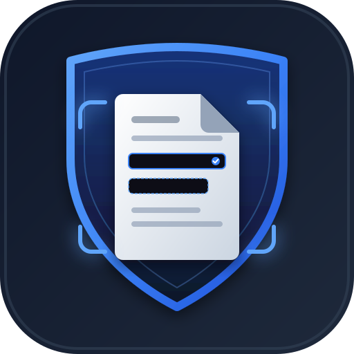
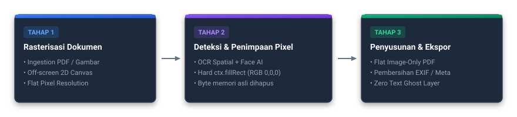

# Cherdocky — Offline-First PII Auto-Redactor & Document Processor

<p align="center">
  
</p>

<p align="center">
  <strong>Client-Side, Zero-Leak, Pixel-Level Document Redaction & Spatial OCR</strong>
</p>

<p align="center">
  <a href="https://imamwahyudiz.github.io/Cherdocky/"></a>
  
  
  
  
</p>

---

## Live Demo

Try the application directly in your web browser with zero installation:

👉 **[Cherdocky Web App (GitHub Pages)](https://imamwahyudiz.github.io/Cherdocky/)**

> **Security Note**: All OCR scanning, face detection, and document redaction processes execute entirely locally within your web browser (client-side). Your documents are never uploaded to any external server.

---

## Table of Contents

1. [Background: Flaws in Conventional Document Redaction](#background-flaws-in-conventional-document-redaction)
2. [Key Features](#key-features)
3. [Comparison with Other Methods](#comparison-with-other-methods)
4. [How the System Works](#how-the-system-works)
5. [System Architecture & Logic Documentation](#system-architecture--logic-documentation)
6. [Tech Stack](#tech-stack)
7. [User Guide](#user-guide)
8. [Running the Project Locally](#running-the-project-locally)
9. [License](#license)

---

## Background: Flaws in Conventional Document Redaction

Many users attempt to redact sensitive documents (identity cards, pay slips, bank statements, etc.) using built-in smartphone markup tools or standard PDF annotations. These approaches leave severe vulnerabilities:

| Flaw in Conventional Methods | Potential Risk | Cherdocky's Approach |
| :--- | :--- | :--- |
| **PDF Text Layer Remains Intact**<br>*(Vector Overlay)* | Black boxes only cover visual display. The underlying text can still be selected, copied, or extracted using PDF parser scripts. | **Flat Image PDF**: The document is rasterized into a flat image canvas, completely eliminating selectable text layers. |
| **Marker / Brush Transparency**<br>*(Opacity Issue)* | Digital highlighters often contain alpha transparency. Boosting image brightness/contrast reveals the text underneath. | **Pixel Overwrite**: Replaces raw pixel RGB values in canvas memory with solid, opaque colors (`ctx.fillRect`). |
| **Separate Annotation Layers** | Markups are stored as isolated metadata objects that can be easily removed in another PDF editor. | **Destructive Rasterization**: Redactions are merged directly into canvas pixel data before regenerating the file. |
| **Metadata & EXIF Residuals** | Camera photos of documents often contain embedded GPS coordinates, timestamps, and device identifiers. | **Metadata Stripping**: Canvas conversion into fresh export blobs automatically strips away all EXIF metadata. |
| **Cloud Privacy Concerns** | Online redactors generally transmit user files to third-party cloud servers. | **100% Offline-First**: All OCR analysis, face detection, and pixel manipulation run entirely on the user's local device. |

---

## Key Features

- **Client-Side Processing**: The entire workflow operates locally inside the browser with zero document data leaving your device.
- **Broad Document Support**:
  - **Images**: JPEG, PNG, WebP (including batch upload of multiple images).
  - **Digital PDFs (Text-Based)**: Instant text position extraction from document matrices.
  - **Scanned PDFs**: Page-by-page rasterization and deep OCR analysis.
- **Sensitive Data (PII) Detection**:
  - National Identification Numbers (16-digit NIK with OCR numeric normalization).
  - Phone Numbers (Indonesian mobile, landline, and international formats).
  - Email Addresses (RFC 5322 compliant).
  - Dates of Birth (DOB) and Birthplace/Date (TTL).
  - Tax Identification Numbers (NPWP) and Healthcare/Social Security Numbers (BPJS / KIS).
  - Bank Account Numbers, Passport Numbers, Driver's Licenses, and Generic IDs.
  - Label-based Contextual Proximity Detection (locating values next to or beneath sensitive field labels).
  - Custom Keyword Search (instant real-time search & auto-redact).
- **On-Device AI Face Detection**:
  - Powered by WebAssembly Google MediaPipe BlazeFace to automatically detect faces on identity cards, passes, or documents.
- **Interactive Verification & Manual Correction Tools**:
  - **Click-to-Toggle**: Click any word box or detected face to toggle redaction on or off.
  - **Manual Block Mode**: Drag freehand rectangular boxes to redact signatures, stamps, photos, or logos.
  - **Targeted Area Scan**: Drag boxes over blurry or low-contrast areas to re-run OCR with adaptive binarization.
  - **Document Rotation**: Rotate pages by 90° with automatic mathematical coordinate recalculation.
  - **Zoom & Auto-Fit Navigation**: Precise zoom levels and responsive pan controls.
- **Flexible Export Options**:
  - Export to Flat PDF (pure image-based document immune to text-layer recovery).
  - Export to Image formats (PNG / JPEG) or packaged ZIP archive for multi-page documents.

---

## Comparison with Other Methods

| Aspect | Built-in Markup / Screenshot | Standard PDF Reader | Cloud Online Redactors | Cherdocky |
| :--- | :---: | :---: | :---: | :---: |
| **Processing Location** | Local | Local | Cloud Server | **Local (Browser)** |
| **PDF Text Layer** | Vulnerable (retained) | Feature-dependent | Varies | **Text-Layer Free (Flat)** |
| **Pixel Overwrite** | High transparency risk | Separate annotations | Varies | **Solid Pixel Overwrite** |
| **Automated PII Detection** | None | Manual | Yes (Files uploaded) | **Automated (Local)** |
| **AI Face Detection** | None | None | Yes (Files uploaded) | **MediaPipe AI (Local)** |
| **EXIF Metadata** | Preserved | Preserved | Varies | **Automatically Stripped** |

---

## How the System Works

The document redaction pipeline executes across 3 stages:

<p align="center">
  
</p>

1. **Stage 1: Ingestion & Rasterization** — Converts every document page (PDF or Image) into a flat canvas image surface with no detached text layers.
2. **Stage 2: Detection & Physical Pixel Overwrite** — Executes spatial text detection (Tesseract.js OCR), face detection (MediaPipe BlazeFace), and manual user selections. Target pixels are permanently overwritten using `ctx.fillRect` (solid RGB).
3. **Stage 3: New Document Assembly** — Encapsulates sanitized canvases into a clean Flat PDF (free of underlying text layers) or pure image files with all EXIF metadata stripped.

---

## System Architecture & Logic Documentation

Comprehensive documentation covering data flows, module architecture, data structures, and design evolution is available here:

👉 **[SYSTEM_FLOW.md](SYSTEM_FLOW.md)**

### Technical Documentation (docs/)

Deep-dive documentation for developers — engine internals, real-world debugging chronicles, and benchmarking methodology:

| Document | Description |
|---|---|
| [docs/ocr-engine.md](docs/ocr-engine.md) | OCR pipeline internals: document classification, preprocessing, multi-PSM sweeps, precision-first PII rules |
| [docs/debugging-chronicle.md](docs/debugging-chronicle.md) | Real-world case studies (whitelist leak, screenshot misrouting, face false positives) + debugging methodology |
| [docs/benchmarks.md](docs/benchmarks.md) | Benchmark & regression gate mechanics, current metrics, honest re-baselining rules |
| [docs/face-recognition-notes.md](docs/face-recognition-notes.md) | Face recognition learning notes (Olivetti / eigenfaces) and its application in Cherdocky |

---

## Tech Stack

- **Frontend**: Vue 3 (Composition API, TypeScript)
- **Build Tool**: Vite
- **Styling**: Tailwind CSS & Lucide Icons
- **OCR Engine**: Tesseract.js (WebAssembly) & ONNX Runtime Web
- **PDF Processing**: pdfjs-dist, jsPDF, and pdf-lib
- **Face Detection**: Google MediaPipe Vision (BlazeFace Short-Range WASM)
- **Utilities**: VueUse

---

## User Guide

1. **Upload Document**: Drop an image file (JPG, PNG, WebP) or a PDF document.
2. **Select Mode (PDF Only)**: Choose between Native Text Mode (for digital PDFs) or OCR Scan Mode (for scanned documents).
3. **Review & Fine-Tune**: Inspect automatically detected sensitive words and faces. Use click-to-toggle or drag manual blocks over additional areas (such as signatures or seals).
4. **Export**: Click the Confirm & Export button and select your preferred output format and quality (Flat PDF, Image, or ZIP).

---

## Running the Project Locally

### Prerequisites
- Node.js version 18 or newer
- npm, pnpm, or yarn

### Installation Steps
```bash
# 1. Clone the repository
git clone https://github.com/ImamWahyudiz/Cherdocky.git
cd Cherdocky

# 2. Install dependencies
npm install

# 3. Launch development server
npm run dev
```
Open your browser at `http://localhost:5173`.

### Production Build
```bash
npm run build
```
Compiled production assets will be generated in the `dist/` directory.

### Benchmark & Regression Gate (For Contributors)
```bash
npm run eval            # Run all Playwright benchmark evaluations (~7 min)
npx vitest run          # Run unit tests for PII rules & OCR engines
node scripts/eval/gate.mjs  # Run regression gate check against baseline
```
Full details: [docs/benchmarks.md](docs/benchmarks.md).

---

## License

This project is licensed under the [MIT License](LICENSE).
