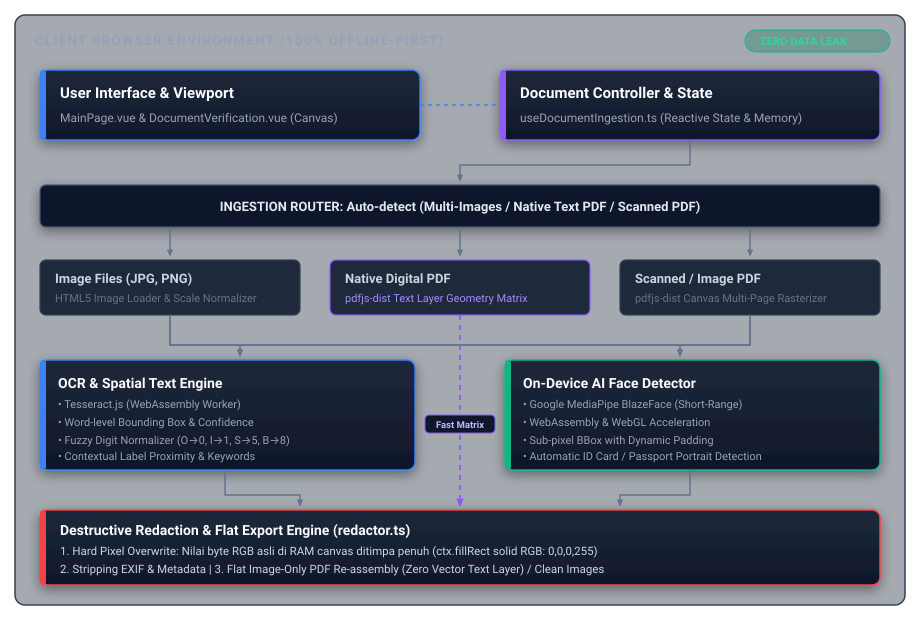
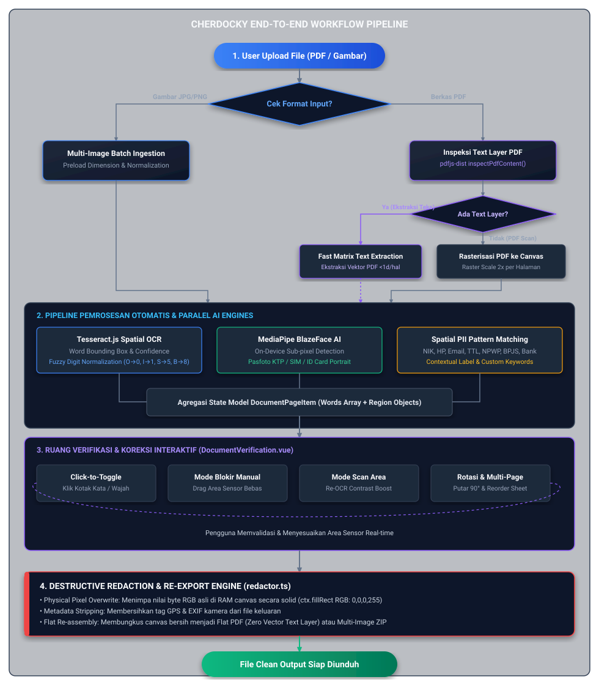
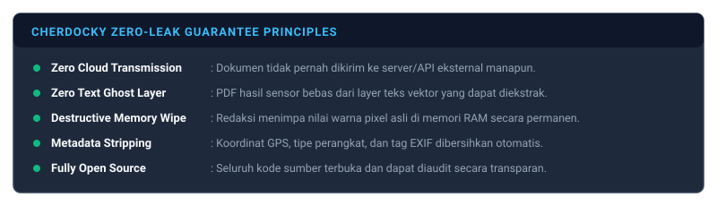

# Logika Sistem, Arsitektur, & Alur Kerja (System Flow) — Cherdocky

Dokumen ini menjelaskan tentang **arsitektur teknis, logika algoritma, alur data (data flow), state management**, serta **evaluasi masalah teknis dan evolusi keputusan desain** hingga rilis awal dari **Cherdocky**.

---

## Daftar Isi

1. [Gambaran Arsitektur Sistem](#1-gambaran-arsitektur-sistem)
2. [Alur Kerja End-to-End (Workflow Flowchart)](#2-alur-kerja-end-to-end-workflow-flowchart)
3. [Logika & Algoritma Inti Per Modul](#3-logika--algoritma-inti-per-modul)
   - [A. Document Ingestion & Routing Module](#a-document-ingestion--routing-module)
   - [B. Spatial OCR Engine (`ocrEngine.ts`)](#b-spatial-ocr-engine-ocrenginets)
   - [C. Contextual Spatial PII Detector (`piiDetector.ts`)](#c-contextual-spatial-pii-detector-piidetectorts)
   - [D. On-Device AI Face Detector (`faceDetector.ts`)](#d-on-device-ai-face-detector-facedetectorts)
   - [E. Interactive Canvas & Spatial Coordinate Engine (`DocumentVerification.vue`)](#e-interactive-canvas--spatial-coordinate-engine-documentverificationvue)
   - [F. Destructive Rasterization & Pixel Redactor (`redactor.ts`)](#f-destructive-rasterization--pixel-redactor-redactorts)
4. [State Management & Data Model](#4-state-management--data-model)
5. [Evolusi & Riwayat Permasalahan Teknis (Problem Log & Decision History)](#5-evolusi--riwayat-permasalahan-teknis-problem-log--decision-history)
6. [Prinsip Keamanan & Jaminan Privasi (Zero-Leak Guarantee)](#6-prinsip-keamanan--jaminan-privasi-zero-leak-guarantee)

---

## 1. Gambaran Arsitektur Sistem

Cherdocky dirancang dengan prinsip **100% Offline-First Client-Side Execution**. Seluruh komputasi berat (rendering PDF, OCR Tesseract, MediaPipe Face AI, image processing, dan penyusunan PDF baru) dieksekusi secara lokal di dalam memori browser pengguna (RAM) melalui WebAssembly, WebGL, dan HTML5 Canvas API.

<p align="center">
  
</p>

---

## 2. Alur Kerja End-to-End (Workflow Flowchart)

<p align="center">
  
</p>

---

## 3. Logika & Algoritma Inti Per Modul

### A. Document Ingestion & Routing Module
- **File**: `src/composables/useDocumentIngestion.ts`
- **Fungsi**: Bertindak sebagai *orchestrator* utama yang menerima input file tunggal atau jamak, mendeteksi karakteristik file, mengelola memori objek URL (`URL.createObjectURL` & `URL.revokeObjectURL`), dan mengarahkan ke pipeline yang tepat.
- **Logika Cerdas**:
  1. Saat file PDF diunggah, fungsi `inspectPdfContent` menganalisis apakah dokumen memiliki teks digital (`hasText`) dan berapa jumlah halamannya.
  2. Jika PDF memiliki teks digital, sistem memberikan opsi modal kepada pengguna:
     - **Mode Teks Asli (Super Cepat)**: Mengambil posisi teks langsung dari matriks PDF tanpa menjalankan OCR berat.
     - **Mode OCR Scan (Mendalam)**: Mengubah PDF menjadi citra dan menjalankan Tesseract OCR untuk mendeteksi teks tulisan tangan, cap stempel, atau dokumen scan berkualitas rendah.

### B. Spatial OCR Engine (`ocrEngine.ts`)
- **File**: `src/utils/ocrEngine.ts`
- **Fungsi**: Menjalankan engine OCR Tesseract.js secara lokal via WebAssembly worker dengan kalkulasi *word-level bounding box*.
- **Karakteristik**:
  - Mengembalikan daftar kata dengan koordinat absolut `(x, y, width, height)` dan tingkat keyakinan (*confidence level*).
  - Dilengkapi fungsi `reScanRegion()` dengan pra-pemrosesan citra lokal (adaptive contrast stretching & binarization grayscale) saat pengguna melakukan *targeted re-scan* pada area yang buram.

### C. Contextual Spatial PII Detector (`piiDetector.ts`)
- **File**: `src/utils/piiDetector.ts`
- **Logika & Algoritma**:
  1. **Fuzzy Digit Normalization**:
     OCR pada dokumen scan sering salah mengenali karakter mirip:
     - Huruf `O`/`o` $\rightarrow$ Angka `0`
     - Huruf `I`/`l`/`|` $\rightarrow$ Angka `1`
     - Huruf `S`/`s` $\rightarrow$ Angka `5`
     - Huruf `B` $\rightarrow$ Angka `8`
     Fungsi `fuzzyNormalizeDigits()` menormalisasi string sebelum diuji oleh regex pattern.
  2. **Pattern Matching Regex**:
     - **NIK**: 16 digit terisolasi (format KTP/KK Republik Indonesia).
     - **Telepon**: Format seluler Indonesia (`08xx`, `+628xx`, `628xx`, `(021)xxx`).
     - **Email**: Format RFC 5322 compliant email strings.
     - **NPWP**: Format 15 atau 16 digit pajak.
     - **BPJS**: Format 13 digit nomor kartu kesehatan/ketenagakerjaan.
     - **Tanggal / DOB**: Format `DD/MM/YYYY`, `DD-MM-YYYY`, atau nama bulan Indonesia/Inggris (Januari–Desember).
  3. **Contextual Spatial Proximity (Deteksi Label Sekitar)**:
     Banyak informasi sensitif seperti *Nama*, *Alamat*, *Tempat Lahir*, atau *Nomor SIM* tidak memiliki pola regex angka tetap. Sistem mendeteksi kata label kunci (misal: `"Nama"`, `"Alamat"`, `"Tempat"`, `"Address"`, `"DOB"`) lalu mencari kata-kata yang terletak tepat **di sebelah kanan secara horizontal** ($|\Delta y| \le \text{threshold}$) atau **di bawah secara vertikal** pada baris yang sama.

### D. On-Device AI Face Detector (`faceDetector.ts`)
- **File**: `src/utils/faceDetector.ts`
- **Fungsi**: Memuat model **Google MediaPipe BlazeFace Short-Range** (`@mediapipe/tasks-vision`) berbasis WebAssembly/WebGL.
- **Logika**:
  - Menerima elemen canvas atau citra bitmap.
  - Menghasilkan koordinat sub-pixel wajah yang dinormalisasi ke dimensi asli dokumen.
  - Menambahkan padding margin dinamis (10–15%) di sekitar wajah agar seluruh area kepala/pasfoto tertutup sempurna saat disensor.

### E. Interactive Canvas & Spatial Coordinate Engine (`DocumentVerification.vue`)
- **File**: `src/components/DocumentVerification.vue`
- **Fitur Interaktif**:
  - **Sistem Koordinat Responsif**: Menghitung transformasi `clientX`/`clientY` dari layar ke koordinat internal dokumen dengan mempertimbangkan rasio `zoomLevel`, rotasi `rotation`, dan posisi *scroll offset*.
  - **Mode Blokir Manual (Redaction Box)**: Menggambar kotak sensor kustom bebas menggunakan pointer event.
  - **Mode Targeted Re-Scan**: Menggambar kotak seleksi untuk memotong area spesifik, meningkatkan kontras, dan menjalankan OCR ulang.
  - **Transformasi Rotasi Matematis**: Saat halaman diputar 90° searah jarum jam:
    $$x' = \text{height} - (y + h), \quad y' = x, \quad w' = h, \quad h' = w$$
    Seluruh koordinat kata (*words*) dan region manual otomatis dihitung ulang secara matematis sehingga kotak sensor tidak bergeser.

### F. Destructive Rasterization & Pixel Redactor (`redactor.ts`)
- **File**: `src/utils/redactor.ts`
- **Logika Eksekusi Anti-Bocor**:
  1. Membuat HTML5 Canvas berukuran resolusi tinggi (`RASTER_SCALE` = 2x).
  2. Menggambar raster citra asli halaman dokumen ke canvas tersebut.
  3. Menjalankan perintah `ctx.fillStyle = redactionColor` dan `ctx.fillRect(x, y, w, h)` langsung ke target pixel memory.
  4. Seluruh byte warna asli pada buffer canvas diganti secara permanen menjadi warna solid (hitam pekat RGB `0,0,0,255` atau pilihan user).
  5. Mengonversi canvas menjadi image blob (PNG/JPEG) atau membungkus setiap halaman canvas datar ke dalam berkas PDF baru menggunakan `jsPDF` / `pdf-lib`.
  6. Dokumen PDF yang dihasilkan **murni berisi citra datar (flat image PDF)** tanpa layer teks vektor, tanpa objek anotasi terpisah, dan tanpa metadata EXIF.

---

## 4. State Management & Data Model

Model data utama yang digunakan dalam antarmuka dan pipeline pemrosesan:

```typescript
// Tipe Dokumen yang didukung
export type DocumentType = 'image' | 'text-pdf' | 'image-pdf';

// Representasi Kata Berbasis Koordinat Spasial
export interface SpatialWord {
  text: string;
  x: number;
  y: number;
  width: number;
  height: number;
  confidence: number;
  forceRedact?: boolean;   // Override manual user (true = disensor, false = tidak)
  pageIndex?: number;
  isContextual?: boolean;  // Ditandai melalui kedekatan label sensitif
}

// Representasi Region Area (Wajah atau Kotak Sensor Manual)
export interface DetectedRegion {
  id: string;
  x: number;
  y: number;
  w: number;
  h: number;
  type: 'face' | 'manual';
  label?: string;
  confidence?: number;
  pageIndex?: number;
}

// Representasi Lembar / Halaman Dokumen
export interface DocumentPageItem {
  id: string;
  pageIndex: number;
  label: string;
  type: 'pdf-page' | 'image';
  sourceBlob?: Blob | File;
  previewUrl: string;
  width: number;
  height: number;
  rotation: number;
  words: SpatialWord[];
  manualRegions: DetectedRegion[];
  faceRegions: DetectedRegion[];
}
```

---

## 5. Evolusi & Riwayat Permasalahan Teknis (Problem Log & Decision History)

Dalam proses perancangan hingga mencapai versi awal yang sempurna, ditemukan sejumlah tantangan teknis nyata. Berikut adalah rekam jejak masalah dan solusi arsitektural yang diambil:

| No | Masalah Teknis yang Ditemukan | Dampak / Risiko | Keputusan Desain & Solusi Final |
| :--- | :--- | :--- | :--- |
| **1** | **Kebocoran Text Layer PDF (Vector Overlay Leak)** | Menaruh anotasi kotak hitam pada PDF tidak menghapus teks vektor aslinya. Teks di baliknya tetap dapat disalin dengan Ctrl+C atau diekstrak oleh script `pdftotext`. | Menerapkan **Destructive Rasterization**. Dokumen di-rasterisasi menjadi flat image canvas, pixel asli ditimpa secara fisik (`ctx.fillRect`), lalu diekspor sebagai PDF berbasis citra murni tanpa layer teks. |
| **2** | **Celah Rekonstruksi Transparansi (Opacity / Alpha Leak)** | Spidol/kuas pada editor gambar bawaan memiliki tingkat transparansi (alpha channel). Menaikkan kecerahan/kontras membuat tulisan di balik coretan terbaca. | Redaksi dilakukan dengan **Hard Pixel Replacement** (alpha = 1.0, RGB solid 0,0,0). Nilai byte memori lama dimusnahkan di RAM sebelum disimpan. |
| **3** | **OCR Lambat pada Native Text PDF** | PDF digital yang sudah memiliki teks bersih dipaksa menjalankan OCR Tesseract yang berat, memakan waktu 10-30 detik per halaman. | Membuat **Dual Ingestion Routing**. Sistem menginspeksi PDF terlebih dahulu; jika memiliki text layer bersih, sistem menawarkan opsi ekstraksi instan geometri matriks `pdfjs-dist` (<1 detik per halaman). |
| **4** | **OCR Misrecognition pada Huruf & Angka KTP** | OCR sering membaca `0` sebagai `O`/`o`, `1` sebagai `l`/`I`, atau `5` sebagai `S` pada KTP dan KK, sehingga deteksi NIK 16 digit sering gagal. | Mengimplementasikan fungsi `fuzzyNormalizeDigits()` dan deteksi label berbasis kedekatan spasial (*Spatial Label Proximity*). |
| **5** | **Pergeseran Kotak Sensor Saat Halaman Diputar (Rotation Drift)** | Saat dokumen diputar 90° atau 180°, koordinat kotak bounding box tidak sinkron dengan rotasi canvas visual, menyebabkan sensor melenceng. | Menerapkan formula transformasi koordinat rotasi linear pada semua data `SpatialWord` dan `DetectedRegion` secara sinkron setiap kali tombol rotasi diklik. |
| **6** | **Memory Leak & Browser Hang pada Dokumen Besar** | Membuka puluhan file gambar resolusi tinggi atau PDF tebal secara bersamaan menyebabkan konsumsi RAM melonjak drastis dan browser crash. | Mengatur pipeline komputasi berurutan (*sequential processing*) dengan progress bar transparan, pembersihan memori objek URL (`revokeObjectURL`), dan pelepasan buffer canvas (`releaseCanvas`). |
| **7** | **False Positive & Kebutuhan Sensor Fleksibel** | Deteksi otomatis tidak selalu 100% sempurna untuk nama unik atau tanda tangan dokumen legal. | Menambahkan interaksi lengkap: **Click-to-Toggle** pada setiap kotak teks, **Custom Keyword Search live**, dan **Mode Blokir Manual** untuk menandai area bebas. |

---

## 6. Prinsip Keamanan & Jaminan Privasi (Zero-Leak Guarantee)

<p align="center">
  
</p>
